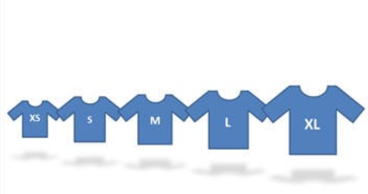
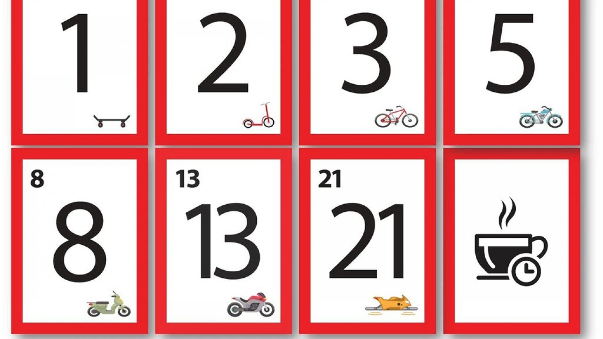
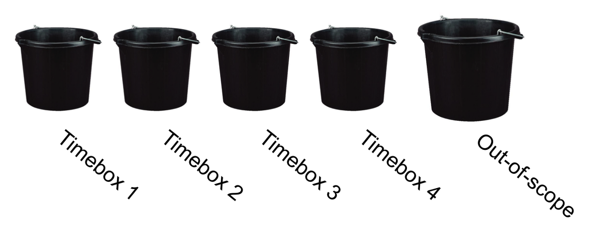

# Scrum Estimation Techniques

 T-Shirt Sizing Technique
==============

Another technique that could be used during a Scrum Estimation meeting is T-Shirt Sizing, This technique estimates items using T-shirt sizes.

1. T-shirt sizes can be written on cards that can be raised during estimation.

2. Product Owner is to call the description of the story and if there is any uncertainty the product owner can answer them.

3. Each team member is asked to evaluate whether a user story is any of the sizes below.

*Figure 3, T-Shirt Sizing Technique*

From there that's when a rough estimation can be achieved from just implementing this technique when it comes to Scrum Estimation.

 Planning Poker Technique
=============

Uses the mix of an Experts opinion, analogy and disaggregation into a reliable estimating approach to get quick results.

1. During a Scrum Estimation meeting, Using Fibonacci sequence, these numbers represent Story Points, One team member is chosen as a Moderator who calls out the description of the User Story, there are any queries, the **Product Owner** answers them.

2. Each Estimator is given a deck of cards, where a selection of one card can be made to represent an estimate to that user story.

3. If all estimators give the same value, then that becomes the final estimate.

4. Else if different values are given, Estimators will have to explain why they chose that value and the process repeats until a conclusion is met.

The Bucket System 
===============
The Bucket System works mainly in the same way as the planning poker system where the team writes the user story to be estimated and places them in a specific "bucket" in order to estimate. 

## Links
- [Task Estimation](TaskEstimation.md)
- [Task Estimation Best Practices](BestPractices.md) 
