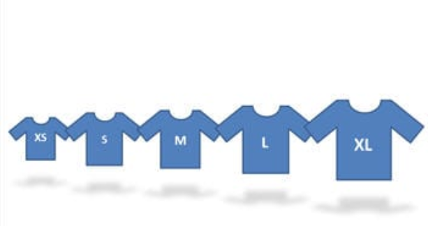

Task Estimation - Scrum Guidelines
===================================

  Introduction
==============

Scrum is a lightweight framework, and implementation of the agile methodology that is used to aid an organization in delivering working software more frequently and it is a way to address complex issues while producing high-quality code. This guide will investigate Task Estimation in Scrum.

* Figure 1, Scrum*

The main goal of doing an estimation is to mark User Stories for each Sprint by importance and the ability of the team members, achieving what is expected of them during the Timebox of a Sprint.

**Scrum Roles include:**

- A **Product Owner:** creates a prioritized by the client called a Product Backlog

- A **Scrum Master:** responsibilities include guiding the Scrum team in the right direction and clearing any issues that may accrue.

- The **Scrum Team:** Also known as the development team, take the product backlog and taking what is most prioritized and creating a Sprint Backlog.

**Scrum Process all these processes are Time-Boxed.**

- **Sprint Planning Meeting**

- **Daily Sprint meeting**

- **Sprint Review**

- **Sprint Retrospectives:**

- **Sprint**

- **Story Points: **Is the amount of effort that a backlog item would need compared to other backlog items.

- **User story:  **This is high-level information of desired features that the end-user would use in the final product, a developer takes into consideration to produce an estimate of effort. 

*        Figure 2, creation of a User story*

Scrum Estimation Methods
========================

- Numeric Sizing: 1 through 10

- The use of T-Shirt Sizing: Extra Small (XS), Small (S), Medium (M), Large (L), Extra Large (XL).

- Using Fibonacci Series: Estimation done with Fibonacci Sequence (1,2,3,5,8)

Scrum Estimation Techniques
===========================

Planning Poker Technique
========================

Uses the mix of an Experts opinion, analogy and disaggregation into a reliable estimating approach to get quick results.

**Participants:**

- Product Owner / Moderator

- Estimators

1. During a Scrum Estimation meeting, Using Fibonacci sequence, these numbers represent Story Points, One team member is chosen as a Moderator who calls out the description of the User Story, there are any queries, the **Product Owner** answers them.

2. Each Estimator is given a deck of cards, where a selection of one card can be made to represent an estimate to that user story.

3. If all estimators give the same value, then that becomes the final estimate.

4. Else if different values are given, Estimators will have to explain why they chose that value and the process repeats until a conclusion is met.

T-Shirt Sizing Technique
========================

Another technique that could be used during a Scrum Estimation meeting is T-Shirt Sizing, This technique estimates items using T-shirt sizes.

1. T-shirt sizes can be written on cards that can be raised during estimation.

2. Product Owner is to call the description of the story and if there is any uncertainty the product owner can answer them.

3. Each team member is asked to evaluate whether a user story is any of the sizes below.

*Figure 3, T-Shirt Sizing Technique*

From there that's when a rough estimation can be achieved from just implementing this technique when it comes to Scrum Estimation.

Best Practices of Scrum Estimation
==================================

- **Maintain small release cycles:** is best practice, it allows the end-user to give feedback before proceeding. Ideally, the product should be released in increments every 2-4 weeks;

- **Test-driven development:** Code the unit test first to keep the project on task throughout this practice produces greater team engagement.

- **Pair programming**: Two programmers working side-by-side. This technique results in an identical degree of productivity to separate programming but delivers higher quality code.

- **Refactoring:** Rework code regularly to achieve the same result with greater efficiency and for readability.

Time Estimation Tools
=====================

Estimation Tools are readily available for developers to use alongside stakeholders, to keep records on performance, Time and other resources.

-  JIRA -- This is a project management tool created to help those in all types of teams, which supports any Agile methodology.

Benefits of Scrum Estimation
============================

- Opportunity to Validate a User story -- allows to properly evaluate if a story and the amount the work it carries or whether it can't be delivered in a single Sprint.

- Scrum Estimation can improve team members estimating skills. By increasing team members estimating skills, future projects can be better estimated leading to more accuracy.

Disadvantages of Scrum Estimation
=================================

- A team member may feel under pressure to improve performance, carrying out the required work on time.

- Team members that may lack estimating skills due to professional issues or maybe a poor perform who require more support than others.

Notes
=====

<https://www.tutorialspoint.com/scrum/scrum_estimation.htm>

<https://www.softwaretestinghelp.com/agile-estimation-techniques/>

<https://stackify.com/agile-methodology/>

 [Agile Estimating and Planning](http://www.amazon.co.uk/Agile-Estimating-Planning-Robert-Martin/dp/0131479415/ref=sr_1_4?ie=UTF8&qid=1330623793&sr=8-4) by Mike Cohn