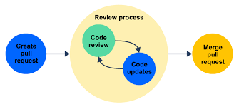
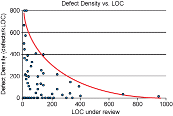

# Code Review

## Introduction

Code review is a software quality assurance process, that every software company must follow,in which source code is analysed, manually or by using an automated code review tool, by a team. The purpose of this process is to find bugs, resolve errors, make sure code standards where followed and to improve code quality.

Code review is an essential process that every software company must follow

### **Code review looks at the following aspects**

**Design:** Is the code well-designed and appropriate for your system?

**Functionality:** Does the code behave as the author likely intended? Is the way the code behaves good for its users?

**Complexity:** Could the code be made simpler? Would another developer be able to easily understand and use this code when they come across it in the future?

**Tests:** Does the code have correct and well-designed automated tests?

**Naming:** Did the developer choose clear names for variables, classes, methods, etc.?

**Comments:** Are the comments clear and useful?

**Style:** Does the code follow the style guides?

**Documentation:** Did the developer also update relevant documentation?

## The code review process

### _Code review process_

## Best practices for reviewing code

**1.** **Spend a maximum of 60 minutes for reviewing**

- A person's efficiency decreases when trying to focus without having a break. This concept also applies here when trying to review code. As an effect of that after 60 minutes of reviewing a person is more likely to not noticed defects and let them go in production.

**2.** **Authors should annotate source code before review**

- Annotations help the code reviewer understand the each block of code better and they remove any uncertainties regarding the purpose of the code.
- At the same time, developers should not add to many annotations.

**3.** **Make use of checklists**

- A well-defined checklist should be used in order to make sure the code does everything it is expected to do.
- Omissions are the hardest defects to be spotted because it's difficult to review something that is not there. Thus, checklists are the most effective way to keep track of what should have been implemented and to combat the challenge of omission finding.

**4.** **Foster a positive code review culture**

- Code reviews should be used not only for the evaluation of developer's performance but also for creating a learning environment. Instead of just commenting on a team's member mistakes or omissions the reviewer should encourage learning how to solve the problem and make sure is not repeated.

### **Guidelines on how to create a positive code review culture:**

**1.** **Tone is very important, stick to the facts and explain**

 Code reviewers should make sure they send the right message and phrase it in non-insulting or discouraging manner:

E.g. Instead of saying "X component should be stateless", stick to the facts and provide justification and strengthen it with proof "For A reason, X component could be stateless, which will improve B. Check *this* documentation."

**2.** **Phrase suggestions as a question**

- Putting suggestions as question can lead to conversations between reviewer and code owner improving teamwork and encouraging the learning environment.

- Phrasing is important here as well, instead of questioning the developer and imposing them a solution like this "Why didn't you do X?" the reviewer should say, "What do you think about doing X here?  It could do A better". The second formulation minimize the chances for the code owner to feel inferior and it opens a dialogue.
  
**3.** **Limit nit-picking**
  
- Nit picking on things like structuring tests in a certain coding standard often is not helpful, and it could take away attention from more important notes. Therefore, it should be marked as a low-priority comment, or even dropped completely unless it is about an agreed-upon coding convention of the team.
  
**4.** **Address all comments**
  
- This is a key element on the side of the person who wrote the code.Out of respect and in order to let the reviewer that his comment was acknowledged, a developer should give at least a reply to the comments. In addition, this makes sure nothing important was missed.
  
**5.** **Take your time and limit review sessions**

#### Defect Density vs line of code

- First, no mistakes can be spotted if the code review is rushed and it loses its point.

- Statistics show after the first 60 minutes, effectiveness drops significantly, and it drops even further after 90 minutes. Therefore, limit review sessions to one hour and/or 300-500 lines of code.
  
#### Defect Density vs Inspection Rate

[https://www.codegrip.tech/productivity/best-practices-for-reviewing-code/](https://www.codegrip.tech/productivity/best-practices-for-reviewing-code/)

[https://codingsans.com/blog/code-review#AddressComments](https://codingsans.com/blog/code-review#AddressComments)

[https://smartbear.com/learn/code-review/best-practices-for-peer-code-review/](https://smartbear.com/learn/code-review/best-practices-for-peer-code-review/)

[https://dev.to/codemouse92/10-principles-of-a-good-code-review-2eg](https://dev.to/codemouse92/10-principles-of-a-good-code-review-2eg)

[https://github.com/google/eng-practices/blob/master/review/index.md](https://github.com/google/eng-practices/blob/master/review/index.md)
