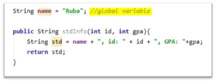
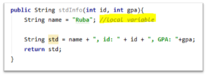
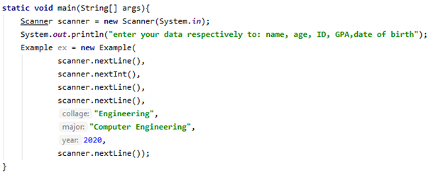
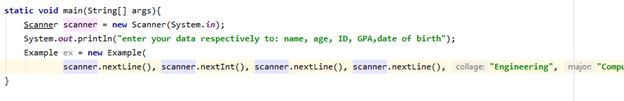

# Coding Standards

## Introduction

Many software companies use coding standards for their programmers to maintain a well-defined and standard style of code.
Programmers should adhere to these coding standards, which are a set of rules and defined guidelines, sets of best practices, programming styles and established conventions when writing code.

Why to use coding standards?

- A coding standard gives a uniform appearance to all the code written by different engineers.
- Improve readability and reduces complexity.
- Help in code reusability and to detect errors easily.
- Promote sound programming practices and increase the efiiciency of programmers.

## Most common coding standards and conventions

**1.** **Limited use of global variables**

- This standard states which variables and data types should be declared globally and which not.

- For example, variables that are accessed only from a method must be local variables of this method not the whole class. (Shown in the below two figures)

    _Global variable bad practice_
        

    _Global variable good practice_
        

**2.** **Naming conventions for local variables, global variables, constants**

- Short, meaningful and understandable variables name make it easier for the reader to understand its purpose, names to be self-explanatory and not require a guide or working knowledge.

- Local variables should be name using camel case lettering starting with lowercase letters and constant names should be formatted using all capital letters.

- Variables names should not contain digits.

- Functions/methods should be written in camel case starting with small letter.

- Names used for functions/methods should be meaningful and relatively short.

- The usage of and identifier for multiple purposes should be avoided by giving a descriptive name.

- Class names should be written in Upper Camel Case and by using nouns or noun phrases.

- One-character parameter names in public methods should be avoided.

**3.** **Indentation and spacing standards**

Proper indentation is very important to increase the readability of the code. For making the code readable, programmers should use White Spaces properly as follows.

- There must be a space after comma between two function arguments.

- Nested blocks should be properly indented and spaced.

- Proper indentation should be there at the beginning and at the end of each block in the program.

- Braces should follow the _"Egyptian brackets”_ style: no line break before the opening brace, line break after the opening brace and before and after the closing one. (Example shown below)

    _Indentation  good practice_
        

    _Indentation  bad practice_
        

## Resources

[https://google.github.io/styleguide/javaguide.html](https://google.github.io/styleguide/javaguide.html)

[https://www.geeksforgeeks.org/coding-standards-and-guidelines/](https://www.geeksforgeeks.org/coding-standards-and-guidelines/)

